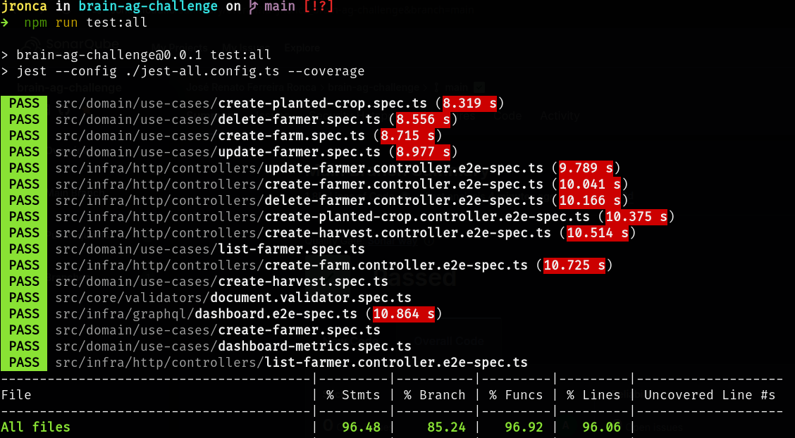
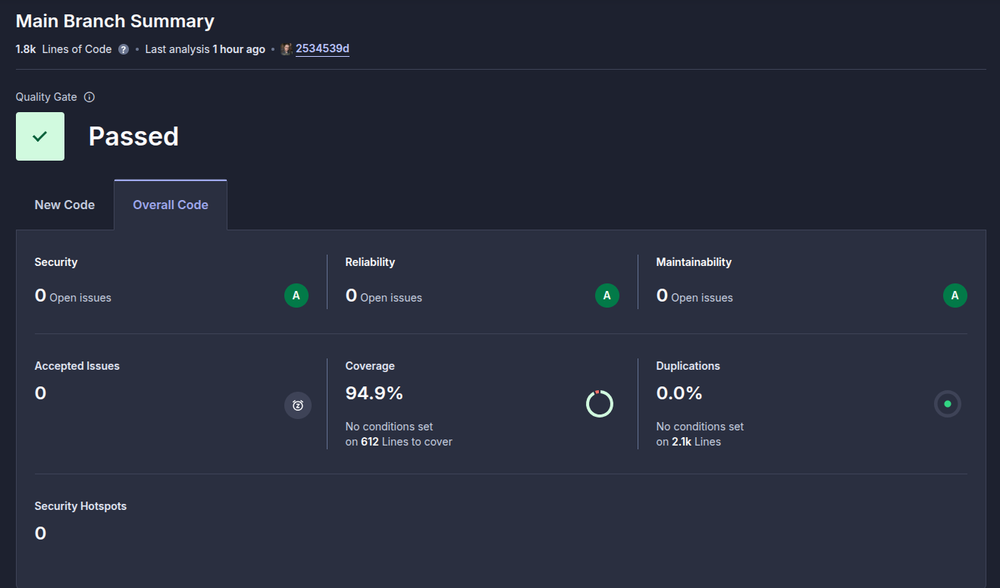

# Brain Agriculture API |  [](https://sonarcloud.io/summary/new_code?id=JRonca_brain-ag-challenge)

## Descrição do Projeto
O **Brain Agriculture API** é uma aplicação backend desenvolvida com o intuito de gerenciar informações relacionadas à produção rural. O sistema permite o cadastro e a visualização de dados sobre propriedades rurais, produtores, safras e culturas, oferecendo uma visão completa do gerenciamento de áreas agrícolas. A solução foi projetada para ser escalável, com arquitetura moderna e modular, utilizando o NestJS como framework principal e Prisma como ORM para facilitar a interação com o banco de dados.

Além do gerenciamento básico de dados sobre propriedades rurais, o sistema oferece uma interface GraphQL para consultas eficientes e flexíveis, permitindo que os usuários possam extrair informações complexas de maneira simplificada. Também foi implementado um dashboard que oferece métricas relevantes e relatórios sobre as propriedades cadastradas.

## Tecnologias Utilizadas

- NestJS: Framework Node.js para construção de aplicações escaláveis e eficientes.
- GraphQL: API para consultas e manipulação de dados com flexibilidade e alta performance.
- Prisma ORM: Ferramenta para facilitar a comunicação com o banco de dados PostgreSQL.
- PostgreSQL: Banco de dados relacional utilizado para armazenar as informações sobre as propriedades e safras.
- Docker: Utilizado para containerizar a aplicação, garantindo consistência no ambiente de desenvolvimento e produção.
- Swagger: Documentação automática da API RESTful, permitindo fácil integração com outras ferramentas e visualização das endpoints.
- SonarQube: Ferramenta de análise de qualidade de código, utilizada para garantir a qualidade e manutenibilidade do código da aplicação.

## Como rodar localmente

```bash
git clone <repo>
cd <repo>
cp .env.example .env
docker-compose up --build
# Subirá a aplicação e o banco de dados PostgreSQL
```

### Como acessar o app

Swagger: http://localhost:3000/api

GraphQL playground: http://localhost:3000/graphql

## Endpoints

- Dashboard (POST): Consulta GraphQL para obter informações gerais sobre o sistema.
- Farmer (POST): Cria um novo produtor.
- Farmer (GET): Obtém a lista de produtores com suporte a paginação.
- Farmer (PUT): Atualiza as informações de um produtor específico.
- Farmer (DELETE): Deleta um produtor específico.
- Farm (POST): Cria uma nova fazenda associada a um produtor.
- Harvest (POST): Registra uma nova safra.
- Planted Crop (POST): Registra uma nova cultura plantada.

## Testes

Comando para rodar testes unitários + e2e:

```Bash
npm install --legacy-peer-deps
npm run test:unit # Unitários
npm run test:e2e # E2E
npm run test:all # Ambos com coverage
```


## Qualidade de Código




## Diferenciais

- Clean Architecture (separação clara de camadas).
- Validações usando Zod.
- Interceptadores e Pipes no NestJS.
- Tratamento de erros global.
- Logs estruturados.
- Banco isolado para testes e2e.
- Testes automatizados no CI.